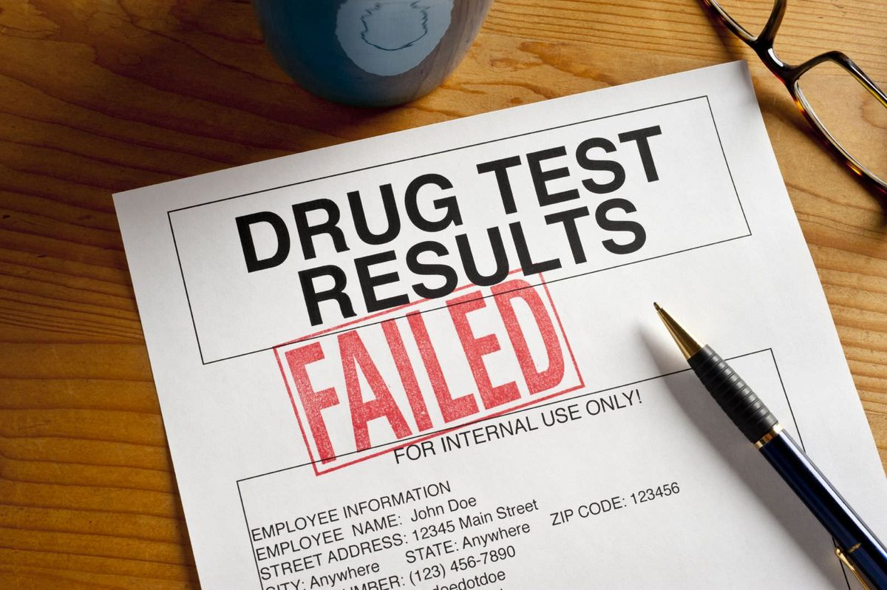
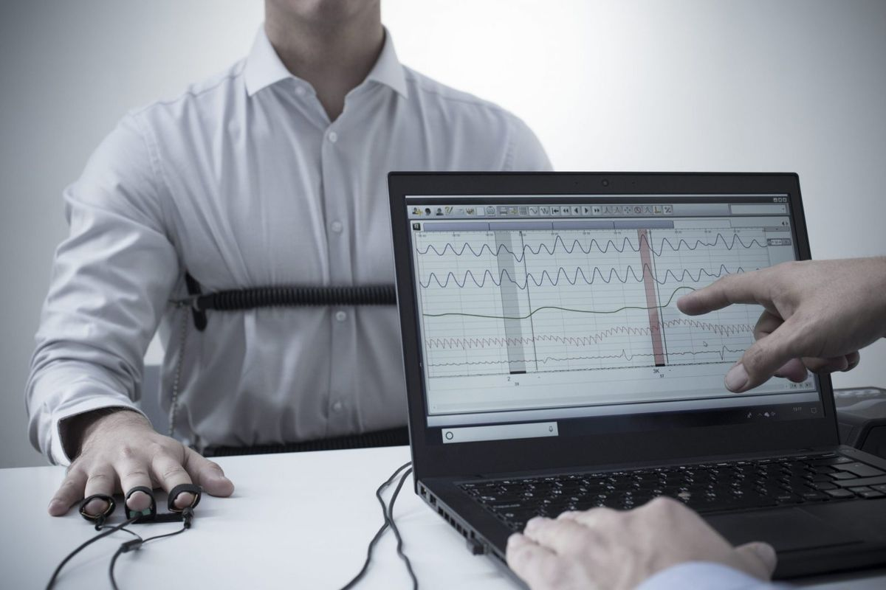

 
 
# How to pass a drug test?
To pass a urine test,you need to drink a lot of water before the drug test. After that you will urinate frequently and that will flush out the marijuana metabolites from the bladder. This will lower the concentration of marijuana metabolites in the urine below the detectable level. There's no exact amount of water required to drink because it depends on a person's body mass and metabolism. But in most cases 2-3 liters will be diluteenough to pass a drug test.
**How to drink it safely?** The kidneys can not excrete more than 0.8 to 1.0 liters per hour. So the safe amount os to consume 0.8 liters per hour and start 3-4 hours before the drug test. Drinking this much water will lower creatinine levels and the specific gravity of the urine. It will also change the color of the urine. If therse parameters are out of normal range the sample will be rejected as diluted. That's why you have to use suppliements.

**10 grams of creatine ethynl supplement,
200 grams of Vitamin B &
Electrolyte Solution**

### All should be taken 3 hours before drug test.

# How to pass a Lie detector test?

Some of the best criminals don't get away with their crimes becasue they are so smart in not getting caught.Becasue they are able to conveince people that they are totally innocent. Even if they are suspect.CIA double agent Robert Hannsen was able to beat lie detector 4 times. Well recently a NSA agent has revaled the way to beat lie detector.All of this tips are real and really work:

**At the beggining they are going to ask some silly questions before asking the main one, you have to act nervous there willingly, so the guys who are sitting infront of you doesn't understands that you've took preparations to beat the detecting machine.(e.g bite your tounge or do some complex maths in your math to make sure that the detector is thinking you are in stress)**

**Stop answering things elaborately because they are going to push you by making you comfortable by, first asking normally and then suddenly ask you the main question. Never get friendly with them.**

**Keep your mind out of the world, because most of the examiners are going to manipulate you by saying that the detector is  giving negative results even if they are not only to make you afraid.**

# Getting away with fingerprints
Well in this method you could get away but only temporarily but that kind of situation could really arise. But Its gonna grow in some days and its going to be actually the same print as it was before and it always will be. Trying those methods are going to be toruble for your ownself, beacuse you might not want the situation when your pressing the sensor of your phone and its not getting unlocked or touching the sensor on your office door and that's not recognizing you as well. It also happens permanently infact it had already happend to some peoples due to accidnets like burning.

# Things that I like:

1)Record collection.(Fav artists: John Mayer,Aerosmith,Santana,Pink Floyd,Natalie Imbruglia,Jenifer Paige,Weekend,Blue Oyster Cult,James Blunt,Eric Clapton Dire Starits)

2) Sitting at the study room of 5th floor at my campus with its windows open.

3)Favourite tag teams: Hardy Boys

4)Memorable wwe paper view (Survivor Series 2001)

5)Favourite Big hair guys:(Chris Jericho in 2000s,HHH in 1998,Axl Rose,Barry Gib in"stayin alive", Jon Bon Jovi in the song "Always" James Hetfield in early days) 

